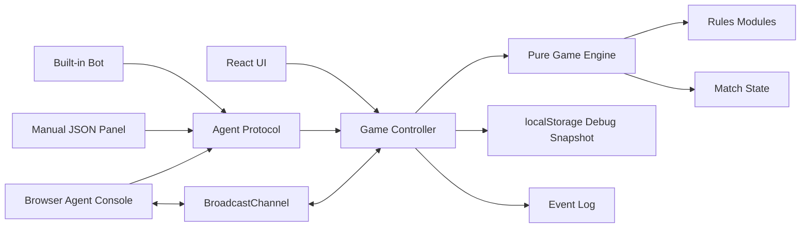

# Core Architecture

## Overview

Hex Sovereign should be built as a static React app with a pure deterministic game engine.

The browser app owns the match state. The engine owns rule correctness. The UI renders state and submits action IDs. Bots and agents use the same legal-action protocol as humans.

## High-Level Flow

## Layer Responsibilities

### Pure Engine

The engine is framework-independent.

Responsibilities:

- Generate boards.
- Track board state.
- Calculate neighbors.
- Calculate groups and liberties.
- Generate legal actions.
- Apply validated actions.
- Resolve captures.
- Derive Domain control.
- Return new state and events.

The engine must not know about React, CSS, localStorage, BroadcastChannel, routing, animation, or portfolio pages.

### Game Controller

The controller is the runtime coordinator.

Responsibilities:

- Hold current match state.
- Ask the engine for legal actions.
- Validate submitted action IDs.
- Advance the match.
- Append event log entries.
- Publish protocol requests.
- Save debug snapshots.
- Connect UI, bot, and agent adapters to the engine.

### UI

The UI is a renderer and interaction surface.

Responsibilities:

- Display the board.
- Display legal move hints.
- Display selected cell/domain details.
- Display current player/phase.
- Display action buttons.
- Submit selected action IDs.
- Show event log and debug panels.

The UI should not duplicate rule logic.

### Agent Protocol

The protocol is the structured contract between the game and any non-human actor.

Responsibilities:

- Return state snapshots.
- Return legal actions.
- Accept selected action IDs.
- Reject stale or illegal submissions.
- Provide clear rejection reasons.

### Storage

For the static version, storage is local only.

Responsibilities:

- Save latest match snapshot.
- Save latest agent request.
- Save latest agent response.
- Support debugging and reload recovery.

Storage is not a source of rule truth. It is a persistence/debug aid.

## Data Ownership

The engine owns derived game truth.

The controller owns runtime state.

The UI owns display state only.

Bots and agents own strategy decisions only.

localStorage owns snapshots only.

## Key Architectural Rule

Only the engine generates legal actions.

Humans, bots, debug panels, and browser agents all submit action IDs back through the controller.

This prevents:

- UI rule drift
- bot cheating
- agent state mutation
- duplicated legal move logic
- fragile future expansions

