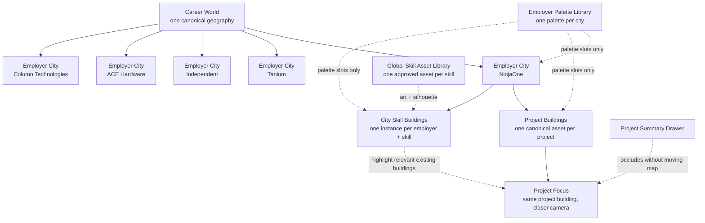

# Career World Canonical Asset and Identity Map

Status: accepted cohesive-world contract and implemented desktop baseline. Animation and responsive polish remain deferred until the static composition is accepted.

> **Regional-layout supersession (2026-07-19):** the current land image, `1600 × 900` geography, employer anchors, zone rectangles, and absolute scene coordinates below describe the implemented runtime baseline only. They are not layout authority for the next map. Five independent territory-local layouts in `design/career-world/territories/` now precede any future global stitch; see `docs/career-world-production/regional-territory-contract.md`. Employer/project identity, evidence boundaries, local skill-instance ownership, accepted art, hierarchy, and projection rules remain binding.

This document is the anti-drift source of truth for the Career World visual system. It supersedes any earlier mock or handoff interpretation that changes architecture between zoom levels, treats an employer as multiple cities, treats a project as a different building at each depth, or generates a new skill building for every use.

## Core contract

1. The career world has one canonical authored geography.
2. Each employer owns one canonical city identity and layout.
3. Each project owns one canonical landmark/building identity inside its employer city.
4. Each skill owns one canonical reusable building asset. Each employer city that uses that skill gets one city-local instance of the same approved art and silhouette; only the employer palette treatment and city placement may change.
5. Zoom reveals additional detail from the same assets. It never substitutes a new city, building, camera direction, or rendering style.
6. Project details open over the map. The map does not reflow, recenter, or swap artwork.
7. The old Blender/system-tour video path is retired. Experimental 3D source files are preserved but deferred; no 3D asset is part of the active runtime or current QA gate.

## Runtime composition source of truth

The active 2.5D runtime uses optimized derivatives of the approved concept art. It is split across four stable layers:

| Layer | Source | Locked responsibility |
|---|---|---|
| Approved runtime art | `public/career-world/art/runtime-art-manifest.json`, `public/career-world/art/runtime-palette-manifest.json`, and `public/career-world/art/**` | 56 optimized canonical derivatives plus exactly 58 employer-palette instance variants with source, alpha, luminance, dimension, and byte receipts |
| Evidence/identity registry | `features/career-world/model/world-registry.ts` | Employer, project, skill, evidence, and instance identity plus the five canonical world anchors |
| Visual placement map | `features/career-world/model/scene-composition.ts` | Exactly 58 capital, project, and employer-local skill instances with fixed absolute world coordinates, ground anchors, footprint classes, and detail thresholds |
| Asset-backed scene | `features/career-world/components/world-scene.tsx` and `features/career-world/rendering/runtime-art.ts` | One persistent terrain/node renderer, zoom-only detail, viewport culling, accessible map selection, and pan/zoom input without 3D, video, or active animation |

The registry anchors plus the visual placement map are the anti-drift authority for city composition. Moving a capital is a controlled anchor change in the registry; moving a project or skill is a controlled absolute-coordinate change in the placement map. Zooming, palette changes, future animation, and project focus must not mutate the resulting coordinates, resize the visual envelope, or substitute another asset. Detail thresholds and viewport intersection may mount a smaller visible subset; that culling is a view optimization over the same fixed registry, not a new layout.

| Employer district | Canonical authored origin |
|---|---:|
| NinjaOne | `(350, 350)` |
| Tanium | `(800, 345)` |
| Independent | `(1300, 350)` |
| ACE Hardware | `(350, 760)` |
| Column Technologies | `(1250, 760)` |

These anchors and every project/skill coordinate live on the same `1600 × 900` plane as the terrain. There is no second set of overview, city-focus, or project-focus coordinates. Camera focus, contextual opacity, labels, and culling may change; identity, ground point, footprint, and visual width do not.

The latest user direction supersedes only the visual-runtime clauses of D-010 and D-012. Approved art derivatives, not reconstructed code-native geometry, are the active visual authority. Stable registry IDs, factual evidence boundaries, reuse rules, fixed placement, and zoom continuity remain binding. Source PNG preservation through Git LFS also remains binding.

Two narrow source overrides are intentional and recorded in the runtime manifest:

- `world/career-world@v1` uses `design/career-world/concepts/world/career-world-v2.png`, because it is the approved cohesive `1600 × 900` terrain with one upper mainland, three mainland employer zones, and two lower employer islands.
- `project/kaizen-metrics@v1` uses `design/career-world/concepts/tracer/project-kaizen-metrics-v1.png`, because it is the approved observatory landmark.

## Concept map



The skill library is globally reusable as an asset library, but its rendered buildings are city-local instances. There is no single global Go, Java, AWS, or AI node shared by unrelated employers.

## Identity and reuse rules

| Entity | Canonical definition | Instance rule | Allowed variation | Forbidden drift |
|---|---|---|---|---|
| Career world | One coastline, mainland, two islands, roads, and sea routes | One world instance | Level-of-detail visibility | Regenerated geography or moving employers between landmasses |
| Employer city | One authored city layout, capital silhouette, and palette per employer | One city per employer | More local detail at closer zoom | Multiple unrelated city designs for the same employer |
| Project | One unique building/landmark per project | One project building in its owning employer city | Level-of-detail geometry and employer palette | Replacing the project with a different building at project focus |
| Skill | One neutral canonical building asset per skill ID | At most one instance for each employer-skill association | Employer palette, city placement, approved level of detail | Duplicate instances for projects in the same city or new geometry per employer, mock, or zoom level |
| Project summary | One overlay state attached to the focused project | Drawn over the current map state | Responsive drawer dimensions | Reflowing, recentering, or regenerating the map |

### Repeated-skill example

If Go appears across three employers, every city instance resolves to `skill/go@v1`:

```text
NinjaOne City / Go
  = skill/go@v1 + palette/ninjaone + city placement

Tanium City / Go
  = skill/go@v1 + palette/tanium + city placement

Independent City / Go
  = skill/go@v1 + palette/independent + city placement
```

The building footprint, roofline, facade rhythm, sign position, view angle, and silhouette stay identical. Color tokens change. Minor wear, ambient props, or surrounding terrain do not create a new asset identity.

If two projects in the same employer city both use Go, both projects reference the same city-local Go building. The project-to-skill relationships are data links; they do not create duplicate physical buildings.

## World hierarchy

```text
Career World
+-- NinjaOne City
|   +-- Project buildings
|   |   +-- Kaizen Agent Platform building
|   |   +-- Vendy VM Platform building
|   |   `-- Kaizen Metrics building
|   `-- City skill buildings
|       `-- one instance per skill used by any NinjaOne project
+-- Tanium City
|   +-- TRA building
|   +-- UAT Automation building
|   +-- CableCar building
|   +-- xSearch building
|   `-- T-Match / EOLMatch building
+-- Independent City
|   +-- ContextForge building
|   `-- Career World Portfolio building
+-- ACE Hardware City / Island
|   +-- Ticket Validation Automation building
|   +-- SAP Table Update Integration building
|   `-- QC ALM Extractor building
`-- Column Technologies City / Island
    +-- Atlassian Platform Automation building
    +-- Atlassian Data Center Resilience building
    `-- Client DevOps Delivery / Implementations building
```

Employer is the city. Project is a unique building or landmark within that city. Skill buildings also live in that city, one instance per skill. Project focus reveals or emphasizes the existing skill buildings related to the selected project; it does not move them or create project-specific duplicates.

## Zoom continuity map

| Detail tier | Visible assets | Current motion | Continuity requirement |
|---|---|---|---|
| World, `<1.45×` | Exact terrain, five capitals, all sixteen project buildings, sparse neutral ambient | None | All five employers coexist; three remain on the mainland and ACE/Column remain on their islands regardless of URL focus |
| Territory, `1.45–2.54×` | Same terrain/capitals/projects plus employer-local skill buildings intersecting the viewport | None | New nodes reveal at their fixed world coordinates; active-employer project labels may appear without moving assets |
| District, `2.55–3.49×` | Same visible node set plus skill labels and tighter viewport culling | None | Coordinates, visual widths, ground anchors, architecture, and employer palette remain unchanged |
| Close, `3.5–4×` | Same fixed nodes at maximum authored raster detail | None | Reserved for later static attachments and animation density; it does not authorize substitute art or layouts |
| Project summary | Exact current camera/map state plus the factual drawer | None | Drawer occludes the map; it does not reflow, pan, zoom, regenerate, or start a video |

There is no separate system-tour level.

## Projection and rendering contract

- Use one orthographic top-down/isometric projection for all world, city, project, and skill assets.
- Lock one camera azimuth, elevation, and north direction. Users may pan and zoom, but the authored asset view does not rotate.
- Use the locked overview's restrained technical-cartography language: near-black navy field, desaturated contour lines, thin isometric strokes, limited emissive accents, tracked uppercase labels, and low bloom.
- Greater zoom may add doors, windows, roof equipment, roads, vegetation, packets, and interior line detail. It may not change the primary masses or silhouette.
- Employer color treatment is a prebuilt static derivative of the approved asset. Runtime CSS filters, blend modes, stacked masks, regeneration, and redrawn architecture are not allowed.
- Skill identity comes from architecture first. A small fixed glyph/sign slot may reinforce identity, but a logo cube is not the building.
- Roads are physical map infrastructure. Packet motion may briefly show a selected project-to-city-skill relationship, but it is not a permanent relationship graph.

## Palette slots

The following material slots remain the shared art-direction vocabulary for employer treatments and future asset revisions. They do not authorize procedural reconstruction of the accepted artwork:

```text
structure.base
structure.shadow
line.primary
line.secondary
accent.emissive
accent.focus
label.primary
terrain.claim
```

Employer palettes fill those slots:

| Employer | Palette family |
|---|---|
| NinjaOne | Muted teal / blue-green |
| Tanium | Coral / orange |
| Independent | Violet / lavender |
| ACE Hardware | Cool red |
| Column Technologies | One muted steel-blue family |

Every city-local skill instance derives from the same canonical skill-art file. The build emits one static palette WebP per employer use so runtime rendering stays cheap; every variant must preserve source dimensions, alpha, luminance, architecture, and silhouette.

## Canonical registry model

The implementation should separate asset definitions from map instances:

```ts
type AssetDefinition = {
  id: string;
  version: number;
  kind: "world" | "city" | "project" | "skill";
  geometryKey: string;
  footprint: { width: number; depth: number };
  orientation: number;
  paletteSlots: readonly string[];
  lods: readonly string[];
  status: "candidate" | "accepted" | "retired";
};

type AssetInstance = {
  id: string;
  assetId: string;
  employerId: string;
  projectId?: string;
  position: { x: number; y: number };
  paletteId: string;
};

type ProjectSkillLink = {
  projectId: string;
  skillInstanceId: string;
};
```

Suggested stable IDs:

```text
world/career-world@v1
city/ninjaone@v1
project/kaizen-metrics@v1
skill/go@v1
skill/java@v1
skill/aws@v1
skill/ai@v1
```

`skill/java@v1` and `skill/ai@v1` are required canonical definitions because the user explicitly named them as reusable skill buildings. `skill/ai@v1` is evidence-linked to Kaizen Metrics through the resume's AWS Bedrock assistant claim. `skill/java@v1` remains unplaced until an approved employer/project mapping exists.

Instance IDs include ownership and placement, for example:

```text
instance/ninjaone/skill/go/01
```

## Asset folder contract

```text
design/career-world/concepts/        # preserved full-resolution approved sources
public/career-world/art/
+-- runtime-art-manifest.json        # source, crop, output, and byte receipts
+-- runtime-palette-manifest.json    # exact employer-instance palette variants and transform receipts
+-- world/*.webp
+-- city/*.webp
+-- project/*.webp
+-- skill/*.webp
+-- ambient/*.webp
`-- palette/{employer}/{kind}/*.webp
```

The public derivatives are the only concept-art files served by the active runtime. Full-resolution sources remain design artifacts. The manifest must keep one record per canonical registry asset and must preserve the identity, reuse, projection, crop, and source lineage of each derivative.

## Asset creation workflow

1. Define the entity ID before generating art.
2. Create one neutral-palette canonical asset sheet in the locked projection.
3. Review silhouette, footprint, orientation, and identity.
4. Mark the asset `accepted` and increment its version only for an intentional redesign.
5. Select and record the approved source panel; do not average or blend conflicting panels.
6. Build an optimized runtime derivative and record its crop, dimensions, and byte receipt in the runtime manifest.
7. Produce employer appearances through the deterministic build-time palette pipeline; validate exact alpha, bounded luminance error, dimensions, and cardinality before promotion.
8. Compose employer cities from registry instances; do not ask an image model to reinvent buildings inside a complete scene.
9. Produce closer zooms from the same composition and asset definitions.
10. Add UI overlays after the map state is fixed.

An AI-generated scene is a concept reference until its individual assets have been extracted, registered, and accepted. It is not itself a reusable asset library.

## Anti-drift gates

Before accepting any new city, project, skill, or zoom mock, verify:

- Same registry ID and version at every zoom.
- Same building footprint, orientation, roofline, facade rhythm, and silhouette.
- Skill variants differ only through employer palette tokens and local placement.
- Each employer city contains at most one instance of a given skill building; projects reference that shared city instance.
- Project buildings remain unique to their project and stable across views.
- Employer cities remain fixed in geography and internal layout.
- Camera projection and north direction match the locked system.
- Rendering remains technical-cartography line art rather than photorealistic 3D or a graph/dashboard.
- Summary UI overlays the current map without altering it.
- No system-tour, video-preview, autoplay, GLB, Blender scene, or 3D runtime import is active. Preserved experimental 3D source files stay outside the runtime and are not a current work lane.

## Current asset status

| Asset | Status | Note |
|---|---|---|
| Career-world geography | Active optimized art | Approved cohesive-world v2 derivative provides one upper mainland with NinjaOne/Tanium/Independent zones and two lower ACE/Column islands on the exact runtime coordinate plane |
| Employer cities and palettes | Active optimized art | Five canonical city derivatives plus deterministic static palette variants; placement and employer identity remain registry-controlled |
| Project buildings | Active optimized art | Sixteen unique canonical derivatives, including the approved Kaizen Metrics observatory override, with one fixed instance in each owning city |
| Skill buildings | Active optimized art | Twenty-seven canonical derivatives; thirty-seven employer-local instances reuse them by ID |
| Ambient kit | Active optimized art | Seven reusable derivatives; placement and motion remain illustrative |
| 58-instance visual composition | Active | Fixed in `scene-composition.ts`; zoom changes detail membership, labels, and camera scale, not identity or position |
| Legacy code-native geometry | Superseded as visual runtime | Preserved for historical traceability and tests; not imported by the active asset-backed scene |
| Old Blender/system-tour media | Retired | Removed from the site |
| Experimental 3D asset kit | Deferred | Preserved on disk; no further modeling, QA, scene work, or runtime integration |

## Remaining content work

- Keep animation disabled until the static overview, five territory views, zoom continuity, culling, and desktop interaction baseline are explicitly accepted.
- Responsive/mobile framing is a later recertification lane; it may change camera defaults and UI density, not world coordinates or asset identity.
- Keep ACE Hardware and Column Technologies project landmarks explicitly identity-only until public-safe evidence records exist. Their visuals cannot create factual copy, skill links, metrics, real-campus implications, or technical claims.
- Add or revise project evidence only through the factual evidence registry and drawers. Entertainment overlays and easter eggs are never evidence.
