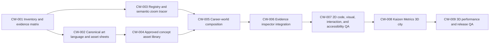

# Career World Production Architecture

Status: execution active; all 56 CW-004 canonical outputs exist, the canonical Batch C generation report is pending, and independent art QA completed terminal inspection with 45 candidates accepted, 11 blocked, and full-library promotion stopped pending D-013 corrections. CW-005 composition planning and D-011 capital normalization are complete; CW-006A evidence integration is complete; CW-008 and CW-009 remain blocked on green CW-007 certification.

Run ID: `career-world-2026-07-16`

## Objective

Replace the evidence graph as the primary portfolio experience with one entertaining, navigable career world while preserving real resume and project evidence as the factual layer. The world is an illustrative navigation surface, not proof of project outcomes.

## Locked product contract

- One canonical world geography.
- One fixed city per employer.
- One unique fixed building per project.
- One reusable canonical geometry per visible skill; each employer may recolor and place one city-local instance.
- Projects link to existing city-local skill buildings rather than spawning duplicates.
- Zoom changes camera scale and level-of-detail visibility only. It does not replace geography, layout, architecture, projection, or art style.
- Generated concept sheets select art direction and one traceable canonical panel; code-native master geometry owns footprint, silhouette, and every runtime LOD. Lower LODs may hide interior detail only.
- Project details appear in an overlay over the unchanged map state.
- The retired Blender/system-tour video path must not return.
- Entertainment-only visual flourishes and stack easter eggs must never be presented as evidence.
- Real claims come from the resume, public-safe project copy, and explicit evidence records.

The canonical identity and reuse details live in [`../career-world-asset-map.md`](../career-world-asset-map.md).

## Non-goals

- Photorealistic or survey-accurate city simulation.
- Free camera rotation that breaks authored composition.
- One-off AI scenes used directly as an unstructured final world.
- Employer-specific redesigns of a skill building.
- Invented confidential project facts for ACE Hardware or Column Technologies.
- Reintroducing a project video as factual evidence.

## Evidence boundary

| Surface | Purpose | Authority |
|---|---|---|
| World, cities, buildings, vehicles, packets, easter eggs | Entertainment and navigation | Illustrative only |
| Project summary and detail copy | Factual portfolio evidence | Resume and approved public-safe records |
| Skill relationship highlight | Navigation aid backed by registry links | Project-skill matrix |
| 3D Kaizen Metrics scene | Entertainment deep dive | Illustrative only; no new factual claims |

The UI must visibly label illustrative scenes and must not imply that scale, traffic, people, building size, machinery, or easter eggs are measured project outcomes.

## Dependency graph

`CW-008` is hard-blocked until `CW-007` is green.

## Promoted implementation shape

- Keep the existing React/vinext application shell and evidence records.
- Introduce `features/career-world/` as a bounded feature surface.
- Store canonical identity, fixed coordinates, palette slots, LOD visibility, project-skill links, and evidence references in typed registries.
- Treat each employer anchor as the city district and camera coordinate, not as a second visible asset instance. Render exactly one employer-capital instance from that employer's `city/*` asset; preserve NinjaOne's accepted capital tuple and hold the other capital positions until collision review.
- Render the authored 2D world as native SVG geometry with a separate semantic HTML hit-target layer. Generated images are concept references, not the source of layout truth.
- For each generated asset, record the selected canonical trace panel. Never average or blend conflicting AI-drawn LOD panels; trace one master silhouette and derive all runtime LODs from it.
- Use a single world coordinate system and camera transform for world, employer, and project focus states.
- Retain the map in the DOM while the project inspector opens.
- Load the later 3D scene on demand so the initial world remains lightweight and usable without WebGL.
- Treat the project summary as a modal overlay: the unchanged map stays mounted and inert, focus remains inside the drawer, and close restores the project control.
- Use `1600 x 900` authored world space with the frozen employer anchors in `asset-inventory.md`. Responsive fitting changes only the camera transform.

## Promotion gates

An item can move from candidate to accepted only when its owner supplies an artifact and an independent reviewer checks the relevant contract:

1. Asset identity: silhouette, footprint, projection, palette slots, and intended reuse are explicit.
2. Continuity: the same IDs and coordinates are used at all zoom levels.
3. Evidence: illustrative and factual content are visibly separated.
4. Interaction: pointer, keyboard, touch, and reduced-motion paths are specified.
5. Performance: expensive rendering is lazy and has a fallback.
6. Verification: build, lint, tests, and visual/runtime evidence are captured.

## Decision log

| ID | Decision | Status | Evidence |
|---|---|---|---|
| D-001 | Employer = one city; project = one building; skill = one reusable geometry with city-local recolor | Accepted | User direction and `docs/career-world-asset-map.md` |
| D-002 | Zoom preserves geometry/layout and only reveals LOD/detail | Accepted | User correction and `docs/career-world-asset-map.md` |
| D-003 | Blender/system-tour media is retired | Accepted and implemented | Current repository diff and green tests |
| D-004 | 3D begins only after 2D world and zoom QA are green | Accepted | Latest user sequencing |
| D-005 | Native SVG visuals + semantic HTML hit targets; immutable registry and camera-only zoom | Accepted | Tech-lead report, Director review |
| D-006 | Generate 27 canonical skill concepts; only evidence-supported instances/links may be placed | Accepted with evidence holds | `asset-inventory.md`, direct user direction, resume, current evidence registry |
| D-007 | Generate all 16 project landmark concepts; six ACE/Column landmarks remain illustrative identity-only with no factual drawer or skill link | Accepted with evidence holds | Direct user entertainment boundary and accepted project hierarchy |
| D-008 | 2D performance budgets: LCP <= 2.5 s, CLS <= 0.10, TBT <= 200 ms, initial compressed JS <= 300 KiB, total compressed transfer <= 1536 KiB, p95 interaction frame <= 50 ms | Accepted before implementation results | QA contract |
| D-009 | 3D engine selection remains deferred until CW-007 and a lazy-load/fallback contract pass | Accepted | Tech and QA reports |
| D-010 | Generated multi-panel pixel parity is not a runtime geometry gate; one selected, traceable concept panel defines a code-native master silhouette, and runtime LOD only removes interior detail | Accepted after bounded correction failure | CW-002B/C showed that repeated Evergreen edits changed panel tier profiles while tree count, placement, projection, style, and a safe trace panel remained stable. This supersedes using AI-drawn cross-panel equality as proof, not the user's no-drift rule. |
| D-011 | Employer anchors are non-visible district/camera coordinates; each employer has exactly one visible capital instance using its canonical `city/*` asset | Accepted before full placement | The manifest and inventory define five employer capitals, while the tracer registry separately created five anchor-level city instances plus a NinjaOne capital from the same asset. Rendering both would duplicate the employer identity. Preserve `instance/ninjaone/capital/01` at `(420, 500)` and add one capital for each other employer only after footprint/collision review. |
| D-012 | Preserve source concept PNGs with scoped Git LFS; runtime imports remain forbidden | Accepted locally; remote preservation unverified | `design/career-world/concepts/**/*.png` is routed through LFS while concepts remain non-runtime trace/reference inputs. Preservation is not verified until an authorized push and clean-room selective pull succeed. |
| D-013 | Correct only the 11 r1 art blockers with derived one-hero prompts and a staged three-then-eight release | Accepted; calibration preflight released | New evidence from 11 cross-lane QA failures invalidates only the v0 multi-panel composition assumption for those exact 11 r1 assets. Freeze the other 45; validate packets and rejected-v0 archives before running ContextForge, OpenAPI, and Workflow Orchestration as the three calibration calls; hold the remaining eight until all three pass. No r2, product, runtime, or 3D work is authorized by this decision. |

## Quality ownership

- Director (`/root`): source-of-truth decisions, lane integration, promotion, final gates.
- Tech lead: repo fit, registry/camera contracts, implementation tickets, code review readiness.
- Art lead: asset inventory, projection/style bible, prompt batches, art QA and promotion recommendations.
- QA lead: testable acceptance matrix, evidence-boundary audit, independent continuity/accessibility/runtime verdicts.
